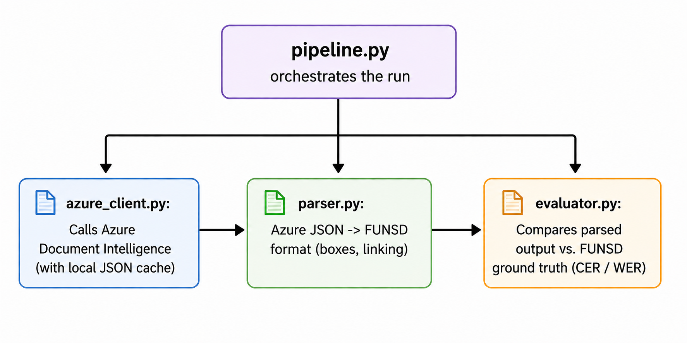
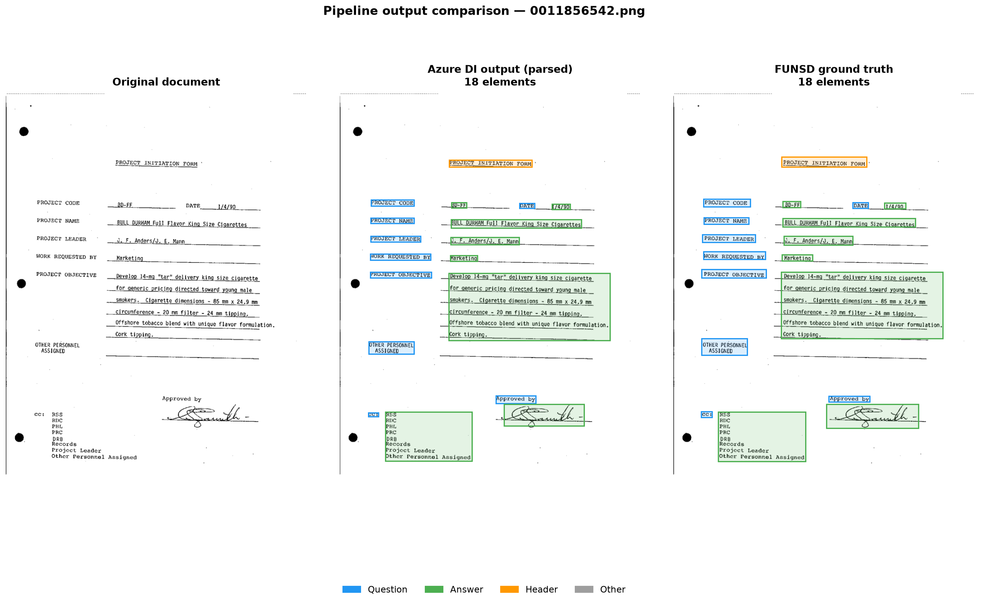
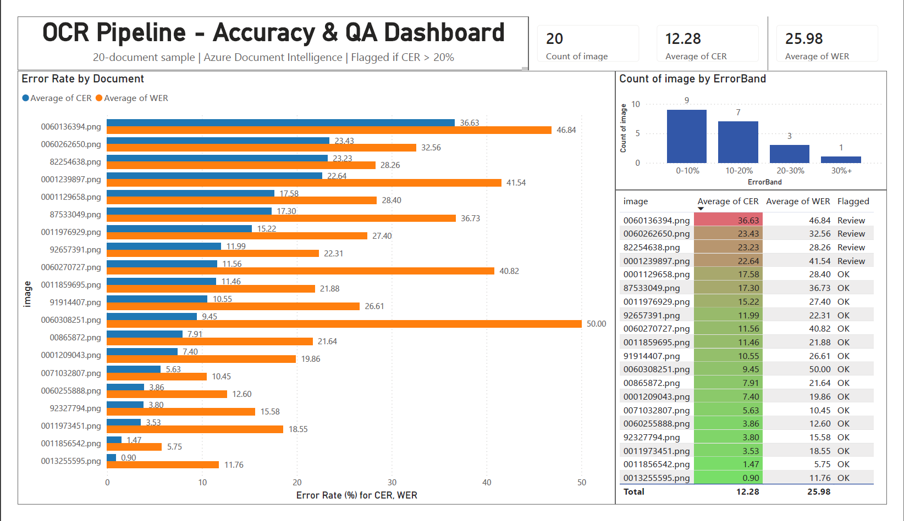

# OCR Document Pipeline


An end-to-end pipeline that sends scanned form images to **Azure Document
Intelligence**, parses the results into the **FUNSD** ground-truth format,
and evaluates extraction accuracy using **Character Error Rate (CER)** and
**Word Error Rate (WER)**.

This project was built to develop hands-on experience with the tools used in
OCR-based data entry workflows, Azure Document Intelligence, OpenCV image
preprocessing, and Python pipeline/evaluation design, ahead of an internship
focused on OCR for biological database records.

On a 20-image sample of the FUNSD dataset, the pipeline achieves an average
CER of **12.28%** and WER of **25.98%** using Azure's prebuilt-layout model with no image
preprocessing. 


---

## Table of Contents

- [Overview](#overview)
- [Architecture](#architecture)
- [Project Structure](#project-structure)
- [Setup](#setup)
- [Usage](#usage)
- [Results](#results)
- [Reporting Dashboard](#reporting-dashboard)
- [What I Learned](#what-i-learned)
- [Possible Extensions](#possible-extensions)

---

## Overview

The pipeline takes a sample of document images, runs each one through Azure
Document Intelligence's `prebuilt-layout` model, converts the response into
the [FUNSD](https://guillaumejaume.github.io/FUNSD/) annotation format
(question/answer/header/other elements with bounding boxes and linking), and
scores the result against FUNSD's hand-labeled ground truth.

The goal was to build something that resembles a real production pipeline,
not just a one-off script, with:

- **Separation of concerns**: each module has one job (call Azure, parse the
  response, evaluate accuracy, orchestrate the run).
- **Reproducibility**: image selection is seeded and logged to an audit file.
- **Cost-awareness**: raw Azure responses are cached locally so the parser
  and evaluator can be iterated on without repeatedly paying for API calls.
- **Testability**: the core geometry and scoring logic is covered by unit
  tests.

### Why FUNSD?

FUNSD is a widely-used benchmark for form understanding, it provides scanned
forms along with ground-truth JSON describing every text element's bounding
box, label (question/answer/header/other), and links between related fields
(e.g. a question and its answer). That structure maps closely to the kind of
field-label extraction needed for digitizing biological specimen records
(e.g. linking a "Species" label to its handwritten value), which is why it
was used as the benchmark dataset for this project.

---

## Architecture




**`azure_client.py`** — the only module that talks to Azure. Sends an image
to Document Intelligence and returns the raw JSON response as a plain dict.
Checks `data/processed/azure_cache/` first and returns a cached result if one
exists for that image + model, to avoid unnecessary API calls during
development.

**`parser.py`** — translates Azure's raw response into FUNSD format. Maps
Azure's key-value pairs to `question`/`answer` elements, links them together,
and classifies any remaining unmapped text lines as `header` or `other`. Uses
an IoU + containment overlap check to avoid double-counting text that Azure
reports both as a key-value pair *and* as a page line.

**`evaluator.py`** — reconstructs each document's full text in reading order
(top-to-bottom, left-to-right) from both the predicted and ground-truth FUNSD
JSON, normalizes it (lowercase, strip punctuation), and computes CER/WER using
[`jiwer`](https://github.com/jitsi/jiwer).

**`pipeline.py`** — ties it all together: selects a seeded random sample of
images, logs the selection to `data/processed/audit_log.json` for
reproducibility, runs each image through the steps above, and prints a final
accuracy summary.

---

## Project Structure

```
ocr-document-pipeline/
│
├── docs/ 
│   └── architecture.png        # Pipeline architecture diagram
│ 
├── data/                       # Ignored by git
│   ├── raw/
│   │   └── training_data/
│   │       ├── images/         # Source document images
│   │       └── annotations/    # FUNSD ground-truth JSON
│   └── processed/
│       ├── azure_cache/        # Cached raw Azure responses (JSON)
│       ├── predictions/        # Parser output (FUNSD-format JSON)
│       ├── audit_log.json      # Seed + list of images used in last run
│       └── results.csv         # Per-document CER/WER, input to dashboard
│
├── dashboard/
│   ├── ocr_qa_dashboard.pbix    # Power BI dashboard file
│   └── results.csv              # Source data for the dashboard
│
├── notebooks/
│   └── exploring_OpenCV.ipynb  # OpenCV preprocessing experiments + notes
│
├── src/
│   ├── __init__.py
│   ├── azure_client.py         # Azure Document Intelligence calls + caching
│   ├── parser.py                # Azure JSON -> FUNSD format
│   └── evaluator.py              # CER / WER scoring against FUNSD ground truth
│
├── tests/
│   ├── test_parser.py
│   └── test_evaluator.py
│
├── pipeline.py                 # Main entry point
├── requirements.txt
├── .env                         # Azure credentials (ignored by git)
├── .gitignore
└── README.md
```

---

## Setup

### 1. Clone and create a virtual environment

```bash
git clone <your-repo-url>
cd ocr-document-pipeline

python -m venv venv

# Windows
venv\Scripts\activate

# macOS / Linux
source venv/bin/activate
```

### 2. Install dependencies

```bash
pip install -r requirements.txt
```

### 3. Configure Azure credentials

Create a `.env` file in the project root (this file is git-ignored and
should never be committed):

```
AZURE_DOCINTEL_ENDPOINT=https://<your-resource-name>.cognitiveservices.azure.com/
AZURE_DOCINTEL_KEY=<your-api-key>
```

You can get these values from your Azure Document Intelligence resource in
the [Azure Portal](https://portal.azure.com/), under **Keys and Endpoint**.

### 4. Add the dataset

Download the [FUNSD dataset](https://guillaumejaume.github.io/FUNSD/) and
place it under `data/raw/training_data/`, so that you have:

```
data/raw/training_data/images/*.png
data/raw/training_data/annotations/*.json
```

---

## Usage

### Run the full pipeline

```bash
python pipeline.py
```

This will:
1. Select a seeded random sample of images (`SAMPLE_SIZE` / `RANDOM_SEED` in
   `pipeline.py`) and log the selection to `data/processed/audit_log.json`.
2. Send each image to Azure Document Intelligence (or load from cache if
   already processed).
3. Parse the result into FUNSD format and save it to
   `data/processed/predictions/`.
4. Evaluate every prediction against its ground-truth annotation and print
   per-document and average CER/WER.

### Adjusting the sample

In `pipeline.py`:

```python
SAMPLE_SIZE = 20      # number of images to process
RANDOM_SEED = 42      # change for a different (but reproducible) sample
FORCE_REFRESH = False # set True to bypass the cache and re-call Azure
```

### Run the tests

```bash
pytest tests/ -v
```

### Explore the OpenCV preprocessing notebook

```bash
jupyter notebook notebooks/exploring_OpenCV.ipynb
```

This notebook documents experiments with grayscaling, denoising, contrast
enhancement (CLAHE), binarization, deskewing, and artifact removal, and the
reasoning behind why preprocessing was ultimately *not* used in the final
pipeline for this dataset.

---

## Results


Pipeline run on a sample of **20 images** from the FUNSD dataset
(seed = `42`):

| Image | CER | WER |
|---|---|---|
| 0001209043.png | 7.40% | 19.86% |
| 0001129658.png | 17.58% | 28.40% |
| 0001239897.png | 22.64% | 41.54% |
| 0011856542.png | 1.47% | 5.75% |
| 0011859695.png | 11.46% | 21.88% |
| 0011973451.png | 3.53% | 18.55% |
| 0011976929.png | 15.22% | 27.40% |
| 0013255595.png | 0.90% | 11.76% |
| 0060136394.png | 36.63% | 46.84% |
| 0060255888.png | 3.86% | 12.60% |
| 0060262650.png | 23.43% | 32.56% |
| 0060270727.png | 11.56% | 40.82% |
| 0060308251.png | 9.45% | 50.00% |
| 0071032807.png | 5.63% | 10.45% |
| 00865872.png | 7.91% | 21.64% |
| 82254638.png | 23.23% | 28.26% |
| 87533049.png | 17.30% | 36.73% |
| 91914407.png | 10.55% | 26.61% |
| 92327794.png | 3.80% | 15.58% |
| 92657391.png | 11.99% | 22.31% |

**Pipeline averages:**

| Metric | Value |
|---|---|
| Average CER | **12.28%** |
| Average WER | **25.98%** |



### Interpreting CER / WER

- **CER (Character Error Rate)** and **WER (Word Error Rate)** measure the
  edit distance between predicted and ground-truth text, normalized by the
  length of the ground truth. Lower is better, `0.0` is a perfect match.
- WER is typically higher than CER because a single character mistake can
  cause an entire word to count as wrong.
- These metrics evaluate Azure's raw text extraction against FUNSD's
  human-labeled transcriptions; they don't directly measure layout/label
  accuracy (e.g. whether a value was correctly linked to its question), which
  would be a useful follow-up metric (see [Possible
  Extensions](#possible-extensions)).

---

## Reporting Dashboard

To make pipeline accuracy results reviewable without reading raw JSON or
CSVs, the results table above was loaded into a Power BI dashboard for
visual QA reporting.



The dashboard surfaces:

- **Per-document CER/WER comparison** (sorted descending by CER), so the
  worst-performing documents are immediately visible rather than buried in
  a table.
- **Summary KPIs**: average CER, average WER, and total documents processed.
- **A flagged-documents table**: any document with CER above 20% is marked
  for review, with conditional-formatting color scaling so high-error
  documents stand out without reading exact numbers.
- **Error distribution by band** (0–10%, 10–20%, 20–30%, 30%+), showing
  that 16 of 20 documents fall under 20% CER, with a small number of
  outliers driving most of the average error up.

This reframes the pipeline's output from a one-off accuracy script into
something closer to an ongoing QA/reporting tool, the kind of dashboard
a team would actually check after each batch run to decide which documents
need manual review.

The `.pbix` file and source CSV are in the [`dashboard/`](dashboard/)
folder.

---

## Known Limitations

- **CER/WER measure text accuracy, not structural accuracy.** The evaluation
  metrics confirm that Azure is reading the right characters and words, but
  they don't measure whether the pipeline correctly *linked* a question to its
  answer, which is the more meaningful signal for a data-entry use case. A
  document where every field label and value is extracted as text but none of
  them are paired correctly would still score well on CER/WER. A
  field-linking accuracy metric (comparing predicted `linking` pairs against
  FUNSD's ground-truth links) would be a more honest end-to-end evaluation
  and is a natural next step.

- **The `header` vs. `other` classification is a heuristic, not a model.**
  Unmapped text lines that don't correspond to a key-value pair are currently
  classified based purely on their y-coordinate: elements in the top 200
  pixels of the image are labeled `header`, everything else is `other`. This
  works adequately on the uniform FUNSD forms used for evaluation, but would
  need to be replaced with something more robust, font size, relative
  position, or a small classifier, before the pipeline could handle the more
  varied layouts found in real biological specimen records.

- **The benchmark dataset doesn't match the real-world target.** FUNSD
  consists of typed and printed administrative forms. The actual use case this
  pipeline is aimed at, digitizing biological specimen records, involves
  handwritten field labels, non-standard layouts, degraded paper, and domain-
  specific vocabulary that Azure's general-purpose `prebuilt-layout` model has
  not been trained on. The CER/WER numbers reported here should be understood
  as a baseline on clean, structured input; accuracy on real specimen labels
  would likely be lower and would motivate training a custom model on
  domain-specific examples.

---

## What I Learned

- **Azure's key-value pairs and page lines overlap.** Azure Document
  Intelligence reports the same text twice, once as part of a key-value
  pair, and again as a page line. Building a reliable bounding-box overlap
  check (IoU + containment, to handle multi-line values) was necessary to
  avoid duplicating elements in the FUNSD output. This was one of the first
  real debugging challenges I hit, and it wasn't surfaced anywhere in the
  Azure documentation, I had to infer it by diffing the raw API response
  against what the parser was producing.

- **Forcing Key-Value extraction requires an undocumented feature flag.**
  By default, Azure's `prebuilt-layout` model does not return key-value
  pairs unless `features=[DocumentAnalysisFeature.KEY_VALUE_PAIRS]` is
  explicitly passed in the API call. This isn't prominently documented and
  cost meaningful debugging time early on, the API would return successfully
  with zero KVPs, which looked identical to a document with no detectable
  fields. Learning to read raw API responses carefully and cross-reference
  the SDK source was the only way to find it.

- **Preprocessing isn't always beneficial.** I assumed OpenCV preprocessing
  (grayscale, denoise, CLAHE, binarization) would improve OCR accuracy, since
  that's the conventional wisdom for traditional OCR engines. Testing several
  preprocessing pipelines against Azure Document Intelligence on the FUNSD
  dataset suggested the opposite, binarization in particular appeared to
  strip grayscale information the model relies on. This finding shaped the
  decision to send raw images directly to Azure rather than adding a
  preprocessing step. Documented in `notebooks/exploring_OpenCV.ipynb`.

- **The gap between CER and WER is informative, not just a reporting detail.** 
  The pipeline's average CER (12.28%) is roughly half the average
  WER (25.98%). This means Azure's errors tend to be single-character
  substitutions, a misread letter, a punctuation ambiguity, rather than
  entirely missing or invented words. For a data-entry pipeline, that's the
  more recoverable failure mode: a character-level correction pass is easier
  to build than recovering from wholesale word deletions or hallucinations.

- **Manual annotation clarifies what automated metrics miss.** Spot-checking
  predicted JSON files against the original document images by hand revealed
  cases where CER looked acceptable but the *structure* was wrong, a
  question element and its answer were detected correctly as text, but not
  linked together. Conversely, some high-CER documents were mostly correct
  with one badly-OCR'd block inflating the score. Hands-on annotation review
  gave a more honest picture of where the pipeline was actually succeeding
  and failing than the aggregate metrics alone.

- **Format standardization is harder than the API call.** The Azure API call
  itself is a few lines. The real engineering work was in `parser.py`:
  normalizing Azure's inconsistent camelCase vs. snake_case field names,
  handling the multi-line KVP containment problem, implementing the IoU
  de-duplication logic, and producing output that matched the FUNSD schema
  closely enough to be evaluated fairly. Getting a cloud OCR output into a
  standard, evaluatable format is non-trivial, it's where most of the
  iteration happened.

- **Caching matters for iteration speed and cost.** Early development
  involved repeatedly re-running the pipeline while tuning the parser. Adding
  a local JSON cache for Azure responses (keyed by image + model) made it
  possible to iterate on `parser.py` and `evaluator.py` without re-querying
  Azure (and re-incurring cost) for unchanged inputs.

- **Reproducibility requires logging, not just seeding.** A random seed alone
  doesn't guarantee someone else can verify your results, logging the exact
  filenames selected (`audit_log.json`) makes the evaluation fully auditable.

---

## Possible Extensions

- **SQL storage**: insert parsed FUNSD elements into a lightweight database
  (e.g. SQLite) as `(document, label, text, box, linking)` records, framing
  the pipeline's output as queryable "biological database records" rather
  than standalone JSON files.
- **Live-connected dashboard**: currently the Power BI dashboard reads a
  static CSV snapshot. Connecting it directly to a SQL database (see SQL
  storage extension above) would let it refresh automatically as new
  documents are processed, rather than requiring a manual export each run.
- **Label/linking accuracy metric**: in addition to CER/WER on raw text,
  measure how often Azure's key-value pairs correctly match FUNSD's
  question→answer links, a more direct proxy for "did we extract the right
  *field*", not just "did we extract the right *characters*".
- **Custom model training**: train a custom Azure Document Intelligence model
  on a small set of labeled specimen-label examples (`DEFAULT_MODEL_ID` in
  `azure_client.py` is already structured to support swapping in a custom
  model ID).
- **Batch comparison across preprocessing strategies**: extend the OpenCV
  notebook's "Version A/B/C/D" comparison into an automated script that runs
  the full pipeline once per preprocessing variant and reports CER/WER for
  each, to make the preprocessing decision data-driven for *any* dataset, not
  just this one.


---

## References

- [FUNSD: A Dataset for Form Understanding in Noisy Scanned Documents](https://guillaumejaume.github.io/FUNSD/) —
  the benchmark dataset used for ground-truth annotations and pipeline evaluation.

- [Azure Document Intelligence](https://azure.microsoft.com/en-us/products/ai-foundry/tools/document-intelligence) —
  Microsoft's cloud OCR service used for text extraction and key-value pair detection.

- [OpenCV Documentation](https://opencv-opencv.mintlify.app/) —
  reference for the image preprocessing techniques explored in
  `notebooks/exploring_OpenCV.ipynb` (grayscaling, denoising, CLAHE,
  binarization, deskewing, morphological filtering).

- [What is OCR?](https://aws.amazon.com/what-is/ocr/) — AWS overview of OCR
  technology; used as a conceptual reference when framing the problem and
  understanding where modern cloud OCR models differ from traditional
  rule-based approaches.

- [15 Best Open-Source Handwriting Datasets](https://www.shaip.com/blog/15-best-opensource-handwriting-dataset/) —
  surveyed when evaluating dataset options; informed the decision to use FUNSD
  as a structured-form benchmark and identified potential future datasets for
  handwritten biological specimen label evaluation.